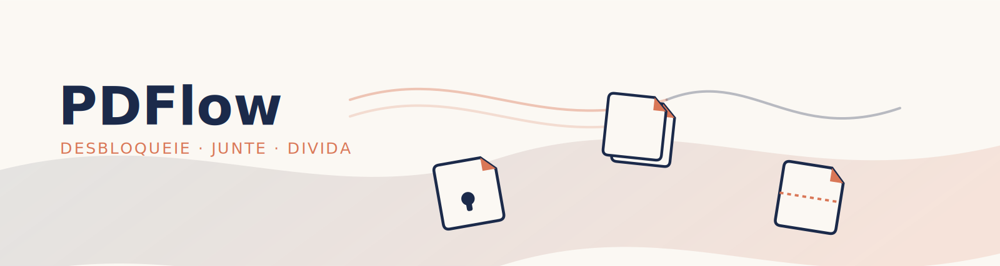

#  PDFlow

Aplicação web para manipulação de arquivos PDF — desbloquear, juntar e dividir documentos — construída com **Streamlit** e **pypdf**.


[](https://github.com/engcarlo/pdflow/actions/workflows/ci.yml)

## 🎨 Identidade visual

O nome **PDFlow** remete ao fluxo entre as três funções do app — desbloquear, juntar e dividir — como etapas de um mesmo processo. O ícone representa um documento com o canto dobrado (referência clássica a arquivos) e uma fechadura vazada ao centro, remetendo à função de desbloqueio.

| Cor | Uso | Hex |
|---|---|---|
| 🟦 Ink navy | Cor primária / texto | `#1B2A4A` |
| ⬜ Paper | Fundo | `#FBF8F3` |
| 🟧 Terracota | Acento / botões | `#D97757` |
| 🟩 Verde | Sucesso | `#3A9679` |
| 🟥 Vermelho | Erro | `#C1493A` |

Assets em [`assets/`](assets): `icon.svg`/`icon.png` (ícone do app), `favicon-32.png`, e `banner.svg`/`banner.png` (imagem de cabeçalho exibida no topo do app).



## 📸 Demonstração

> Adicione aqui um GIF ou screenshots do app em uso.
> Sugestão: `docs/screenshots/demo.gif`

```
docs/screenshots/
├── unlock.png
├── merge.png
└── split.png
```

## ✨ Funcionalidades

### 🔓 Desbloquear
Remove a senha de um PDF protegido, informando a senha de acesso, e disponibiliza o arquivo desbloqueado para download.

### 📎 Juntar
Combina dois ou mais arquivos PDF em um único documento, com controle da ordem de junção.

### ✂️ Dividir
Divide um PDF em três modos:
- **Todas as páginas** — cada página vira um arquivo separado (`.zip`)
- **Um único intervalo** — extrai um intervalo específico de páginas (ex: páginas 2 a 5) em um novo PDF
- **Múltiplos intervalos personalizados** — define vários intervalos de uma vez (ex: `1-3, 5, 8-10`), cada um gerando um arquivo dentro de um `.zip`

Todo o processamento acontece em memória, na sessão do navegador — nenhum arquivo é gravado em disco no servidor.

## 🛠️ Stack

- [Python 3.10+](https://www.python.org/)
- [Streamlit](https://streamlit.io/) — interface web
- [pypdf](https://pypdf.readthedocs.io/) — manipulação de PDFs

## 🚀 Como rodar localmente

```bash
# Clone o repositório
git clone https://github.com/SEU-USUARIO/pdflow.git
cd pdflow

# Crie um ambiente virtual (recomendado)
python -m venv venv
source venv/bin/activate      # Linux/Mac
venv\Scripts\activate         # Windows

# Instale as dependências
pip install -r requirements.txt

# Execute o app
streamlit run app.py
```

O app abrirá automaticamente em `http://localhost:8501`.

## 🐳 Como rodar com Docker

Não precisa ter Python instalado — só o Docker.

### Opção 1: Docker Compose (recomendado)

```bash
docker compose up --build
```

O app estará disponível em `http://localhost:8501`. Para rodar em segundo plano:

```bash
docker compose up -d --build
```

Para parar:

```bash
docker compose down
```

### Opção 2: Docker puro

```bash
# Build da imagem
docker build -t pdflow .

# Executar o container
docker run -p 8501:8501 --name pdflow pdflow
```

### Detalhes da imagem

- Baseada em `python:3.12-slim` (imagem enxuta)
- Roda como usuário não-root por segurança
- Possui healthcheck integrado, verificando `http://localhost:8501/_stcore/health`
- Cache de camadas otimizado: dependências são instaladas antes de copiar o código, então alterações no `app.py` não forçam reinstalação dos pacotes

## 🌐 Deploy

O PDFlow já está disponível online no [Streamlit Community Cloud](https://pdflow.streamlit.app/).

Acesse [pdflow.streamlit.app](https://pdflow.streamlit.app/) para desbloquear, juntar e dividir arquivos PDF diretamente no navegador, com processamento em memória.

## 📁 Estrutura do projeto

```
pdflow/
├── app.py                  # Aplicação principal (Streamlit)
├── requirements.txt        # Dependências do projeto
├── ruff.toml               # Configuração do linter
├── Dockerfile              # Imagem Docker do app
├── docker-compose.yml      # Orquestração simplificada via Docker Compose
├── .dockerignore           # Arquivos excluídos da imagem Docker
├── assets/
│   ├── icon.svg              # Ícone do app em vetor
│   ├── icon.png              # Ícone do app em PNG (256×256)
│   ├── favicon-32.png        # Favicon em PNG (32×32)
│   ├── banner.svg            # Banner de cabeçalho em vetor
│   └── banner.png            # Banner de cabeçalho em PNG
├── .streamlit/
│   └── config.toml         # Tema visual do app
├── .github/
│   └── workflows/
│       └── ci.yml          # Pipeline de CI (lint + verificação de build)
├── docs/
│   └── screenshots/        # Prints/GIFs de demonstração
├── LICENSE
└── README.md
```

## ✅ Integração Contínua (CI)

Este repositório usa **GitHub Actions** para validar automaticamente cada push e pull request na branch `main`:

- Roda o código em três versões do Python (3.10, 3.11, 3.12)
- Lint com [`ruff`](https://docs.astral.sh/ruff/)
- Verificação de que o código compila sem erros de sintaxe

O workflow está em [`.github/workflows/ci.yml`](.github/workflows/ci.yml).

## 🗺️ Roadmap

- [ ] Suporte a proteção de PDF com senha (adicionar senha, não só remover)
- [ ] Remoção de restrições de permissão (impressão/cópia) além da senha de abertura
- [ ] Reordenação de páginas por drag-and-drop
- [ ] Rotação de páginas
- [ ] Compressão de PDF
- [ ] Testes automatizados (pytest)
- [ ] Publicar imagem no Docker Hub / GitHub Container Registry

## 🤝 Contribuindo

Contribuições são bem-vindas! Sinta-se à vontade para abrir uma *issue* ou enviar um *pull request*.

1. Faça um fork do projeto
2. Crie uma branch para sua feature (`git checkout -b feature/nova-funcionalidade`)
3. Commit suas mudanças (`git commit -m 'Adiciona nova funcionalidade'`)
4. Push para a branch (`git push origin feature/nova-funcionalidade`)
5. Abra um Pull Request

## 📄 Licença

Este projeto está sob a licença MIT — veja o arquivo [LICENSE](LICENSE) para mais detalhes.

## 👤 Autor

**Seu Nome**
- GitHub: [@engcarlo](https://github.com/engcarlo)
- LinkedIn: [carlo-yukio-nunes](https://linkedin.com/in/carlo-yukio-nunes)
